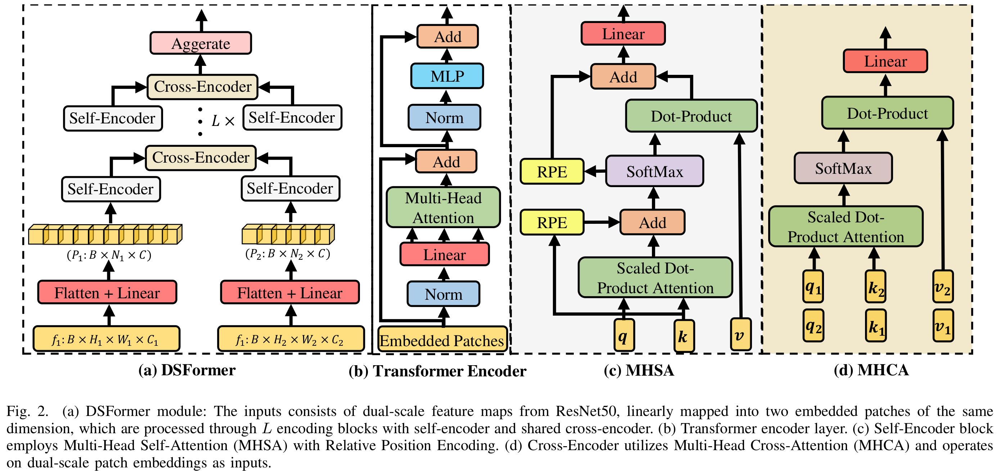
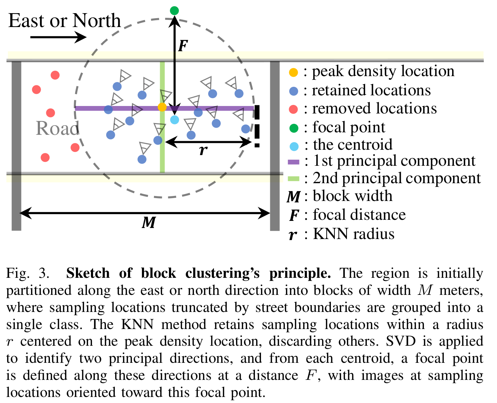

# DSFormer: A Dual-Scale Cross-Learning Transformer for Visual Place Recognition

## Introduction

The official repository of "**DSFormer: A Dual-Scale Cross-Learning Transformer for Visual Place Recognition**".



<p align="center">
  
</p>

* [Arxiv Preprint](https://arxiv.org/abs/2507.18444)
* [Official Paper](https://ieeexplore.ieee.org/document/11146630)

## Environment Setup

* **Create conda enviromnet**

```text
conda create -n dsformer python=3.10

conda activate dsformer

pip install torch==2.0.1 torchvision==0.15.2 --index-url https://download.pytorch.org/whl/cu118

pip install -r requirements.txt
```

* **Install rpe-index==1.2.0** ([rpe-index](https://github.com/microsoft/Cream/tree/main/iRPE)) and depend on [cuda11.8](https://developer.nvidia.com/cuda-11-8-0-download-archive)

```text
cd DSFormer/models/rpe_ops

python setup.py install --user
```

## Testing

* **Datasets**
  
  [MSLS](https://www.mapillary.com/dataset/places)
  
  [Pittsburgh](https://data.ciirc.cvut.cz/public/projects/2015netVLAD/Pittsburgh250k/)
  
  [Tokyo24/7](https://data.ciirc.cvut.cz/public/projects/2015netVLAD/Tokyo247/)
  
  [SFXL](https://docs.google.com/forms/d/e/1FAIpQLSdQEcRULPLNr0Zk5x85jNw3vcel_RxoQoKtsrJA7QPjWPVqZg/viewform)
  
* **Trained Models**
  
  We provide pretrained model weights based on both ResNet50 and DINOv2 (ViT-B) backbones, with a global descriptor dimensionality of 512.
  
  DSFormer (ResNet50): [Google Drive](https://drive.google.com/file/d/1wUx8R6suPYOrrgM8GXerub2ayUmCrafq/view?usp=sharing)
  
  DSFormer (DINOv2 (ViT-B)): [Google Drive](https://drive.google.com/file/d/1-6zbxhVHLZ-PAskVnF8fl0FI9LYaiof7/view?usp=sharing)

  
* **Run Testing**

  ```text
  python test.py --backbone ResNet50 --dataset_folder /path/to/yourpath --dataset_name msls --split val
  ```

## Block Clustering

If you would like to use the the processed SFXL dataset based on **Block Clustering** for training your model, we provide two options:

* 1. Directly use `datasets/hdbscanplaces_datasets.py`, and train_dataset_folder is the path of raw panoramic image dataset (~930G).

  ```python
  from datasets.hdbscanplaces_dataset import HDBScanPlaces
  groups_num = 5
  groups = [HDBScanPlaces(train_dataset_folder='/path/your/raw_SFXL', 
                          focal_dist=args.focal_dist,
      					current_group=n // 2, 
                          min_images_per_class=10,
      					angle=[0, 90][n % 2])
      					for n in range(groups_num * 2)]
  ```

* 2. A subset of approximately 4.2 million images(~188G) is extracted from the raw SFXL panoramic dataset using the Block Clustering.

  ```text
  python extract_images.py --dataset_folder /path/your/raw_SFXL --extracted_folder /path/your/subset
  ```

  Use:

  ```python
  from datasets.hdbscanplaces2_dataset import HDBScanPlaces
  groups_num = 5
  groups = [HDBScanPlaces(train_dataset_folder='/path/your/subset', 
      					current_group=n // 2, 
      					angle=[0, 90][n % 2])
      					for n in range(groups_num * 2)]
  ```


## Acknowledgements

[EigenPlaces implementation in PyTorch](https://github.com/gmberton/EigenPlaces)

[CosPlace implementation in PyTorch](https://github.com/gmberton/CosPlace)

[R2Former  implementation in PyTorch](https://github.com/bytedance/R2Former)

[BoQ  implementation in PyTorch](https://github.com/amaralibey/Bag-of-Queries)

[IRPE implementation in PyTorch](https://github.com/microsoft/Cream/tree/main/iRPE)

## Cite
@ARTICLE{11146630,
  author={Jiang, Haiyang and Piao, Songhao and Gao, Chao and Yu, Lei and Chen, Liguo},
  journal={IEEE Robotics and Automation Letters}, 
  title={DSFormer: A Dual-Scale Cross-Learning Transformer for Visual Place Recognition}, 
  year={2025},
  volume={},
  number={},
  pages={1-8},
  doi={10.1109/LRA.2025.3604761}}

